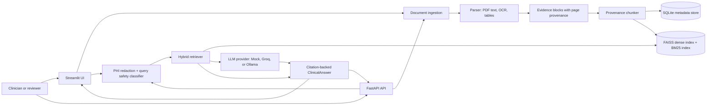
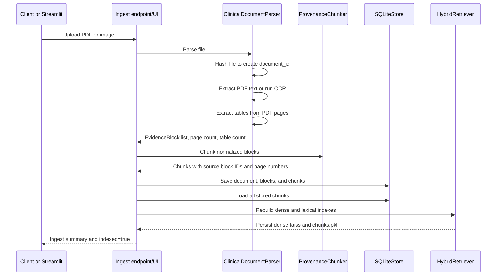
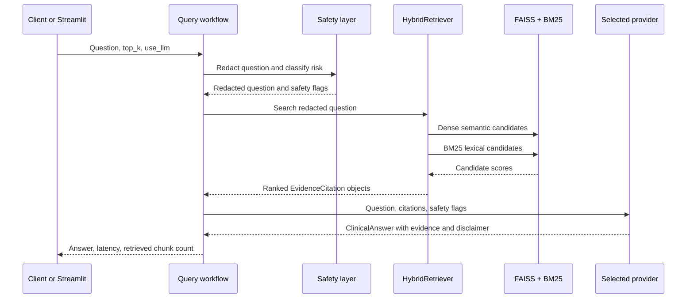
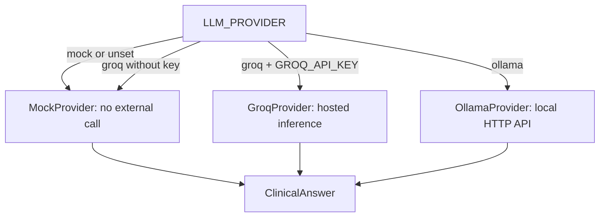

# Clinical Document Intelligence RAG

Clinical Document Intelligence RAG is a local-first, production-inspired retrieval-augmented generation (RAG) system for clinician-facing evidence review. It accepts clinical PDFs and images, extracts text and tables with page provenance, indexes the resulting evidence, and answers questions with citations to the retrieved source pages.

It is a demonstration and engineering project, not a diagnostic or treatment system. It does not replace a qualified clinician, a medical record system, institutional policy, or emergency care.

## What the system does

The project is designed around an auditable workflow rather than a generic chatbot:

- Ingests born-digital PDFs, scanned PDFs, and common image formats.
- Uses PyMuPDF for PDF text, pdfplumber for tables, and optional Tesseract OCR when a page has little or no extractable text.
- Keeps document IDs, page numbers, block IDs, and source types attached to evidence throughout processing.
- Splits evidence blocks into overlapping, provenance-preserving chunks.
- Combines semantic similarity from FAISS and exact-term matching from BM25.
- Redacts several common PHI-like patterns in questions before they reach an LLM provider.
- Flags emergency, diagnosis, and medication-dosing questions for visibility in the answer.
- Returns source quotes, document IDs, page numbers, scores, limitations, confidence, and a clinical disclaimer.
- Includes a FastAPI API, a Streamlit demonstration UI, retrieval evaluation, and provider benchmarking.

## Architecture

### System overview



### Main components

| Area | Location | Responsibility |
| --- | --- | --- |
| Application entry point | `main.py` | Creates the FastAPI application and starts Uvicorn. |
| API factory | `app/api/app.py` | Registers CORS and the health, document, query, and metrics routers. |
| Dependency wiring | `app/api/deps.py` | Lazily creates and caches the parser, chunker, SQLite store, retriever, and LLM provider. |
| Configuration | `app/core/config.py` | Loads `.env` and environment variables, creates data directories, and defines runtime defaults. |
| Document parser | `app/document_ai/parser.py` | Extracts PDF text, applies OCR fallback, extracts tables, and assigns page/block provenance. |
| Chunker | `app/document_ai/chunker.py` | Normalizes blocks and creates overlapping chunks linked to their source block and page. |
| Storage | `app/storage/sqlite_store.py` | Persists document, evidence block, and chunk metadata in SQLite. |
| Retrieval | `app/retrieval/hybrid.py` | Builds or loads FAISS and BM25 indexes and merges their scores. |
| Safety | `app/safety/phi_redactor.py`, `app/safety/query_classifier.py` | Redacts common identifiers and labels risky query categories. |
| LLM providers | `app/llm/providers.py` | Generates a structured answer using mock, Groq, or local Ollama inference. |
| Schemas | `app/models/schemas.py` | Defines the request, response, evidence, chunk, and evaluation contracts. |
| Demo UI | `streamlit_app.py` | Provides ingest, ask, evidence, and metrics workflows. |
| Evaluation | `scripts/` and `app/evaluation/` | Measures retrieval quality, latency, and provider behavior. |

## End-to-end workflows

### 1. Document ingestion and indexing



Detailed behavior:

1. The upload filename is reduced to its final path component before it is written under `data/uploads` by the API.
2. A SHA-1 digest of the file contents supplies a stable 16-character document ID for the current implementation.
3. For PDFs, text is read page by page. If a page contains fewer than `MIN_PDF_TEXT_CHARS` characters and OCR is enabled, the page is rendered and passed to Tesseract.
4. `pdfplumber` separately extracts tables. Each non-empty table becomes a `table` evidence block whose rows are joined with `|` separators.
5. Each block records `document_id`, `page_number`, `block_id`, `block_type`, text, and optional confidence/bounding-box fields.
6. The chunker normalizes whitespace, applies `CHUNK_SIZE` and `CHUNK_OVERLAP`, and creates deterministic chunk IDs that retain the originating block and page.
7. SQLite stores the source metadata. The retriever rebuilds its indexes from all stored chunks, so adding a document makes it searchable alongside earlier documents.

### 2. Question answering



The query path is:

1. Validate the request: questions are 3-2000 characters and `top_k` is 1-20.
2. Replace detected email addresses, phone/ID-like values, dates, and MRN/patient-ID patterns with placeholders such as `[EMAIL]` and `[PATIENT_ID]`.
3. Classify the redacted question for `emergency_or_urgent_symptoms`, `diagnosis_request`, and `medication_dosing_request` terms.
4. Encode the question with the configured Sentence Transformers model. Dense search and BM25 each produce candidates.
5. Combine scores using `DENSE_WEIGHT` and `BM25_WEIGHT`, rank the union of candidates, and return the requested number of citations.
6. Pass only the redacted question, retrieved quote snippets, and safety flags to the selected provider.
7. Return a structured answer. Every provider includes the retrieved citations and a limitation/disclaimer; the mock provider intentionally avoids unsupported clinical conclusions.

### 3. Provider selection



- `mock` is the default and requires no API key. It produces extractive evidence synthesis.
- `groq` uses the Groq chat completion API when `GROQ_API_KEY` is present.
- `ollama` sends a non-streaming request to the configured local Ollama `/api/generate` endpoint.

### 4. Streamlit demonstration workflow

The Streamlit app has four tabs:

1. **Ingest:** upload a PDF or image, parse it, save its blocks/chunks, and rebuild the indexes.
2. **Ask:** enter a clinical evidence question, inspect the generated answer, safety flags, disclaimer, and page-level quotes.
3. **Evidence:** inspect indexed documents and a table of stored chunks for provenance/debugging.
4. **Metrics:** view indexed document/chunk counts and the command for running the configured evaluation set.

The Streamlit path calls the same parser, chunker, store, retriever, redaction, classifier, and provider abstractions used by the API, which keeps the demo behavior close to the service behavior.

## Technology stack

- **API:** FastAPI, Uvicorn, Pydantic, pydantic-settings
- **UI:** Streamlit
- **Persistence:** SQLite and local filesystem artifacts
- **Retrieval:** Sentence Transformers embeddings, FAISS inner-product search, and `rank-bm25`
- **Document processing:** PyMuPDF, pdfplumber, Pillow, pytesseract
- **Inference:** Mock provider by default, optional Groq, optional local Ollama
- **Testing/evaluation:** Pytest and custom retrieval metrics
- **Runtime:** Python 3.11 target, with Docker support

## Getting started

### Local setup

From the `clinical-doc-intelligence-rag` directory:

```powershell
python -m venv .venv
.\.venv\Scripts\Activate.ps1
pip install -r requirements.txt
```

On macOS/Linux, activate the environment with `source .venv/bin/activate` instead.

Start the API:

```bash
uvicorn main:app --reload
```

Open the interactive API documentation at `http://localhost:8000/docs` and the health endpoint at `http://localhost:8000/api/v1/health`.

In another terminal, start the UI:

```bash
streamlit run streamlit_app.py
```

The Streamlit interface is normally available at `http://localhost:8501`.

### Docker

The included Compose configuration starts the API and mounts `./data` so SQLite records, uploads, and indexes survive container recreation:

```bash
docker compose up --build
```

The default container configuration uses `LLM_PROVIDER=mock`. OCR additionally requires a working Tesseract installation in the runtime image; verify the Dockerfile if you change the image or OCR setup.

## API reference by workflow

The API prefix is `/api/v1` by default. FastAPI also publishes a complete OpenAPI document at `/openapi.json`.

### Health check

```bash
curl http://localhost:8000/api/v1/health
```

Use this for a lightweight service availability check.

### Ingest a document

```bash
curl -X POST http://localhost:8000/api/v1/documents/ingest \
  -F "file=@./path/to/clinical-document.pdf"
```

The response reports the generated document ID, safe filename, page count, evidence block count, chunk count, extracted table count, and whether indexing completed.

### List documents

```bash
curl http://localhost:8000/api/v1/documents
```

### Ask an evidence question

```bash
curl -X POST http://localhost:8000/api/v1/query \
  -H "Content-Type: application/json" \
  -d '{"question":"What abnormal labs are present?","top_k":5,"use_llm":true}'
```

The response contains the redacted question, a `ClinicalAnswer`, request latency in milliseconds, and the number of retrieved chunks. `ClinicalAnswer` includes `answer`, `key_findings`, `citations`, `confidence`, `limitations`, `safety_flags`, and `disclaimer`.

### Metrics

The metrics router exposes the current application metrics endpoint under the same `/api/v1` prefix. Use the generated Swagger UI at `/docs` to inspect the exact response shape for the installed version.

## Configuration

Settings are loaded from environment variables and an optional `.env` file. Pydantic settings maps field names to uppercase environment variables, for example `llm_provider` becomes `LLM_PROVIDER`.

| Variable | Default | Purpose |
| --- | --- | --- |
| `APP_ENV` | `demo` | Runtime environment label. |
| `API_PREFIX` | `/api/v1` | API route prefix. |
| `DATA_DIR` | `data` | Root for local runtime data. |
| `UPLOAD_DIR` | `data/uploads` | Uploaded source files. |
| `SQLITE_PATH` | `data/clinical_rag.sqlite3` | SQLite database location. |
| `VECTOR_DIR` | `data/vector_index` | FAISS index and serialized chunk artifacts. |
| `EMBEDDING_MODEL` | `sentence-transformers/all-MiniLM-L6-v2` | Sentence Transformers model. |
| `CHUNK_SIZE` | `900` | Maximum normalized chunk length. |
| `CHUNK_OVERLAP` | `150` | Overlap between adjacent chunks. |
| `RETRIEVAL_K` | `8` | General retrieval candidate setting. |
| `RERANK_K` | `5` | Default UI retrieval count. |
| `DENSE_WEIGHT` | `0.55` | Weight for semantic similarity. |
| `BM25_WEIGHT` | `0.45` | Weight for lexical similarity. |
| `ENABLE_OCR` | `true` | Enables image OCR and low-text PDF fallback. |
| `MIN_PDF_TEXT_CHARS` | `80` | PDF text threshold that triggers OCR. |
| `LLM_PROVIDER` | `mock` | `mock`, `groq`, or `ollama`. |
| `GROQ_API_KEY` | empty | Required for Groq inference. |
| `GROQ_MODEL` | `llama-3.1-8b-instant` | Groq model name. |
| `OLLAMA_URL` | `http://localhost:11434/api/generate` | Ollama generation endpoint. |
| `OLLAMA_MODEL` | `llama3.1:8b` | Local Ollama model name. |

Example `.env` settings for local Ollama:

```dotenv
LLM_PROVIDER=ollama
OLLAMA_MODEL=llama3.1:8b
OLLAMA_URL=http://localhost:11434/api/generate
```

For Groq, set `LLM_PROVIDER=groq` and provide `GROQ_API_KEY`. Keep credentials out of source control.

## Data and generated artifacts

The `data/` directory contains both bundled evaluation assets and runtime state:

```text
data/
├── clinical_rag.sqlite3       # Created at runtime
├── uploads/                   # API upload targets
├── vector_index/
│   ├── dense.faiss            # FAISS dense index
│   └── chunks.pkl             # Indexed chunk objects
├── artifacts/                 # Evaluation or generated artifacts
└── eval/
    ├── golden_dataset.json
    └── who_pneumonia_eval.json
```

The vector index is rebuilt from all chunks in SQLite after ingestion. If the embedding model changes, remove/rebuild the generated vector artifacts and re-ingest or rebuild the corpus so vectors are consistent with the selected model.

## Evaluation and benchmarking

Run the test suite:

```bash
pytest
```

Run the configurable retrieval evaluation after populating `data/eval/golden_dataset.json` with gold chunk or document IDs:

```bash
python scripts/run_eval.py
```

This reports retrieval metrics such as Recall@K, Hit@K, and latency. The bundled WHO guideline workflow is dependency-light and reproducible:

```bash
python scripts/evaluate_who_guideline.py
```

The inference benchmark compares provider behavior, response size, latency, and estimated cost mode:

```bash
python scripts/benchmark_inference.py
```

The bundled WHO results are a small curated retrieval benchmark, not clinical validation. Treat them as an engineering/demo signal only; benchmark outcomes depend on the corpus, embedding model, query set, and local hardware.

## Safety, privacy, and limitations

This repository is not a regulated medical device and must not be used for patient care. The current safety layer is intentionally lightweight:

- PHI redaction is regex-based and only covers a small set of common patterns. It is not a complete de-identification system.
- Safety flags are labels for downstream visibility. They do not provide emergency triage or clinical safeguards.
- Retrieved quotes are evidence candidates, not verified medical recommendations.
- The mock provider is extractive and intentionally avoids unsupported conclusions, while external/local providers may produce variable text.
- Local SQLite and filesystem storage are suitable for a demo, not multi-user clinical deployment.
- Production use would require authentication, authorization, audit logging, encryption, retention controls, robust de-identification, monitoring, clinical validation, access controls, and formal safety/regulatory review.

## Development layout

```text
clinical-doc-intelligence-rag/
├── main.py                    # FastAPI/Uvicorn entry point
├── streamlit_app.py           # Interactive demo
├── app/
│   ├── api/                   # Application factory and HTTP routes
│   ├── core/                  # Settings and constants
│   ├── document_ai/           # Parsing and provenance chunking
│   ├── evaluation/            # Retrieval metrics
│   ├── llm/                   # Provider interface and implementations
│   ├── models/                # Pydantic contracts
│   ├── retrieval/             # Dense + lexical retrieval
│   ├── safety/                # Redaction and query classification
│   └── storage/               # SQLite persistence
├── data/eval/                 # Gold datasets and bundled results
├── scripts/                   # Evaluation and benchmark commands
└── tests/                     # Safety and metrics tests
```

## Project highlights

This project demonstrates a complete RAG lifecycle: ingestion, structure-aware extraction, provenance preservation, persistent indexing, safety-aware retrieval, provider abstraction, citation-backed responses, and measurable evaluation. The architecture keeps local/demo components replaceable, so a production system could substitute managed storage, stronger de-identification, a reranker, observability, authentication, and validated clinical workflows without changing the core request shape.
